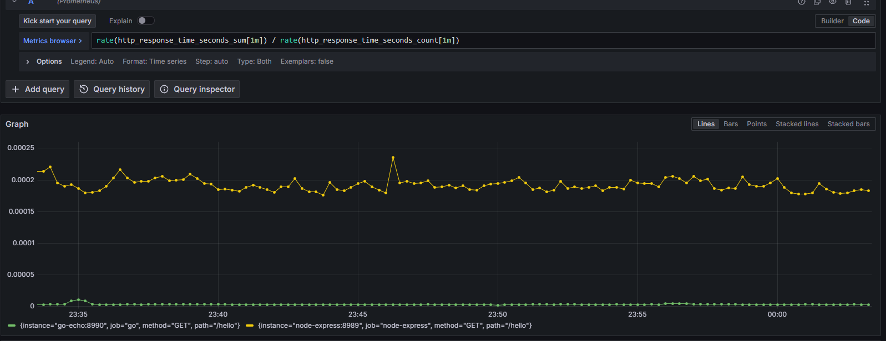
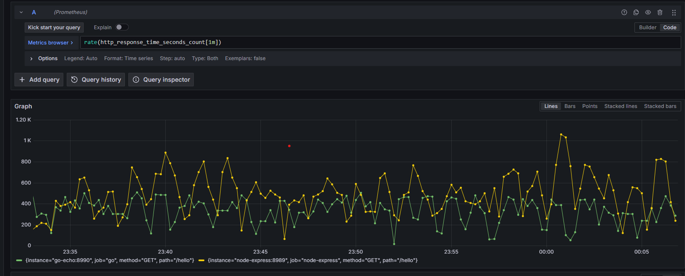
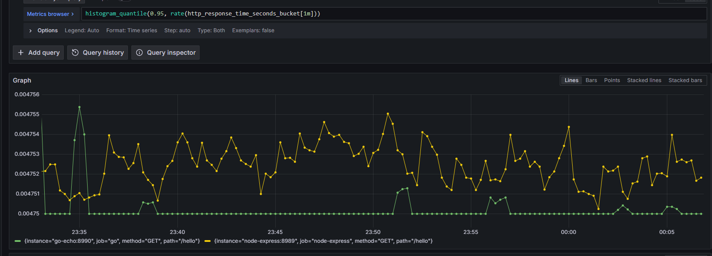
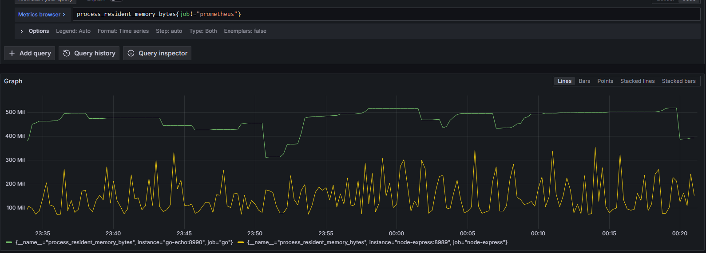
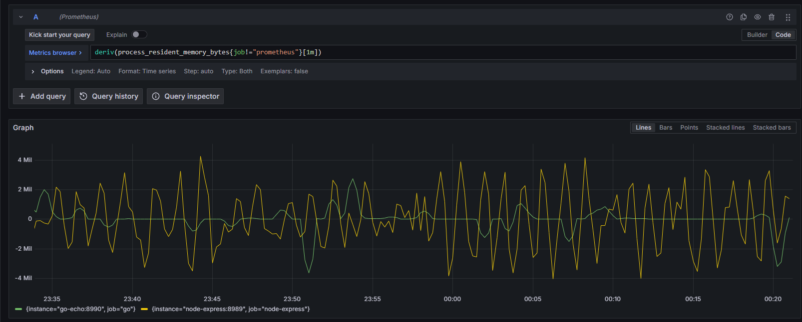
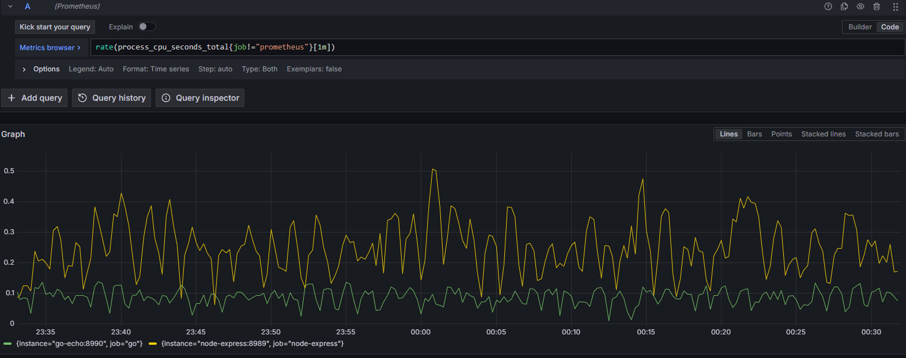

# Node vs Go

And so started learning..   

What better way to learn than comparison; and so..

Note: this is not meant to be a serious benchmark or anything; just me learning and proving myself I have to let go of NodeJs..

## Hello world!
Everything starts with a hello world..   

To my surprise `Hello, World` doesn't really make NodeJS loose or look that bad.. not at all..   
We shall see in further phases. One would say it's meant to be used for `hello world`'s :D  

For this phase, given two popular 'slim' and simmilar frameworks, Echo (golang) and Express (nodejs); two golang spammers are setup to spam 25k requests, with a 2 second sleep in between, constantly - just out of curiosity    

And so, how does it look..
##### Average response times 

#### Request Rate

#### 0.95 Perc Response time

#### Current Memory Usage
I definitely did not expect this - I'm definitely doing something wrong (maybe???? hopefully!!)   
(or, likely, the node prom lib does not record it proper - in docker stats, node takes more mem than go; or maybe V8 is just awesome!?!?!?)   
TODO!!   

#### Rate of Change of Memory Usage      

#### Peak Memory Usage   
Again, surprising..   

#### Rate CPU Usage
   

### Notes and TODOs so far
- TODO: look into prom usage!?
- phase 1.5 - add bare bones NodeJs and bare bones Golang to the mix (std lib)
- phase 2 - lets make some garbage!!!! (on purpose this time :D)
- TBC
