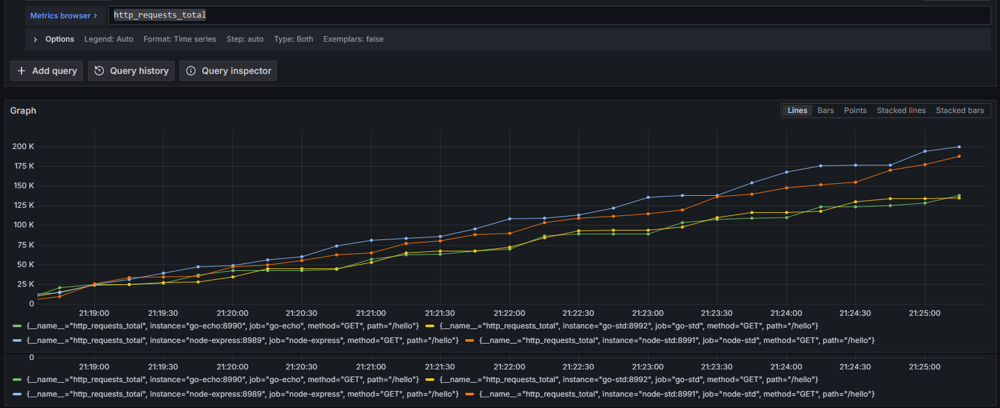
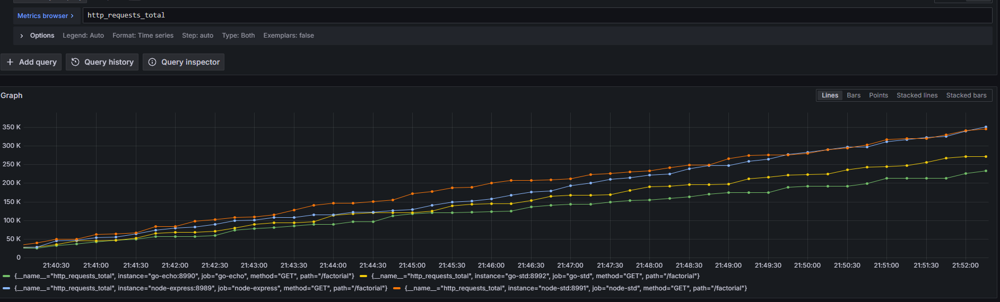
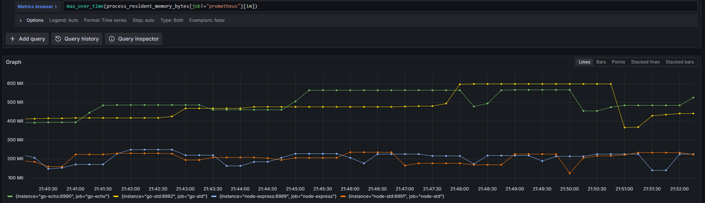
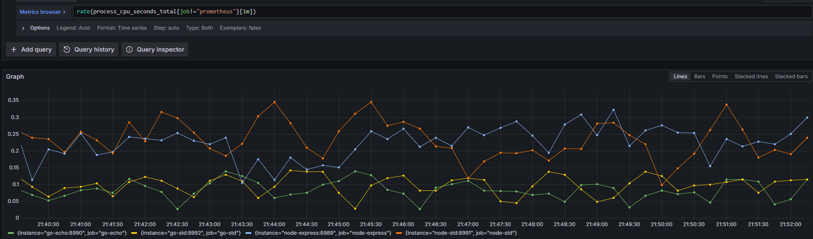
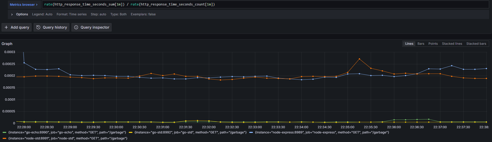
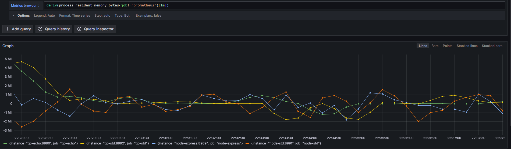
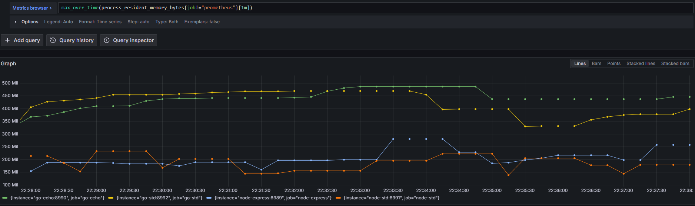
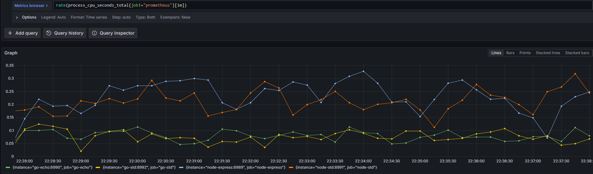

# Node vs Go

With aim of learning, I'm comparing various operations between the two; starting with very easy (hello world) and towards wherever my understanding and experimentation takes me.

Currently, recording and comparing Prometheus metrics between the two:  
- Requests Total `http_requests_total`
- Average response times `rate(http_response_time_seconds_sum[1m]) / rate(http_response_time_seconds_count[1m])`
- Request rate `rate(http_requests_total[1m])`
- 0.95 Perc response time `histogram_quantile(0.95, rate(http_response_time_seconds_bucket[1m]))`
- Current memory usage `process_resident_memory_bytes` 
- Rate of change of memory usage `deriv(process_resident_memory_bytes[1m])`
- Peak memory usage `max_over_time(process_resident_memory_bytes[1m])`
- Rate CPU usage `rate(process_cpu_seconds_total[1m])`

Note: this is not meant to be a serious benchmark or anything; it's meant to be and should be treated as a learning exercise.

## Current rules

Two golang spammers are setup to spam 25k requests, with a 2 second sleep in between, constantly.   

The receivers are 4 HTTP APIs: 
- node-express - one of the most used 'slim' NodeJS libraries
- node-std - std library implementation of a http server
- go-echo - one of the most used 'slim' Golang libraries
- go-std - std library implementation of a http server

At time, the comparison might not be fair; or my usage of certain constructs and libraries might not be equal between the above. The comparisons and their results will evolve over time as my understanding does.

## Hello world!

Simply `/hello` replying with a 'Hello world' string

##### Requests Total

##### Average Response Times 

#### Request Rate

#### 0.95 Perc Response time

#### Current Memory Usage

#### Rate of Change of Memory Usage      

#### Peak Memory Usage  

#### Rate CPU Usage

## Factorial - introducing some compute

Simply `/factorial` replying with a computed 100!

##### Requests Total

##### Average Response Times 

#### Request Rate

#### 0.95 Perc Response time

#### Current Memory Usage

#### Rate of Change of Memory Usage      

#### Peak Memory Usage  

#### Rate CPU Usage

## Garbage - on purpose this time

Simply `/garbage` replying with ok! but creating 10,000 objects (node) or 10,000 structs (go)

##### Requests Total

##### Average Response Times 

#### Request Rate

#### 0.95 Perc Response time

#### Current Memory Usage

#### Rate of Change of Memory Usage      

#### Peak Memory Usage  

#### Rate CPU Usage
