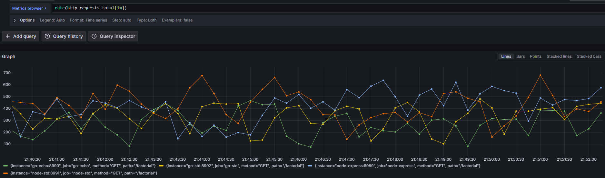
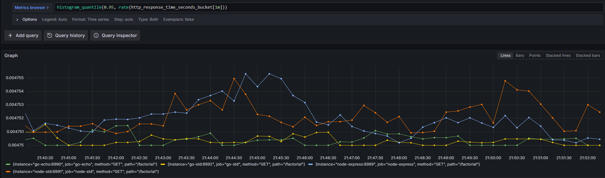

## Factorial - introducing some compute

Simply `/factorial` replying with a computed 100!

##### Requests Total

##### Average Response Times 

#### Request Rate

#### 0.95 Perc Response time

#### Current Memory Usage

#### Rate of Change of Memory Usage      

#### Peak Memory Usage  

#### Rate CPU Usage
