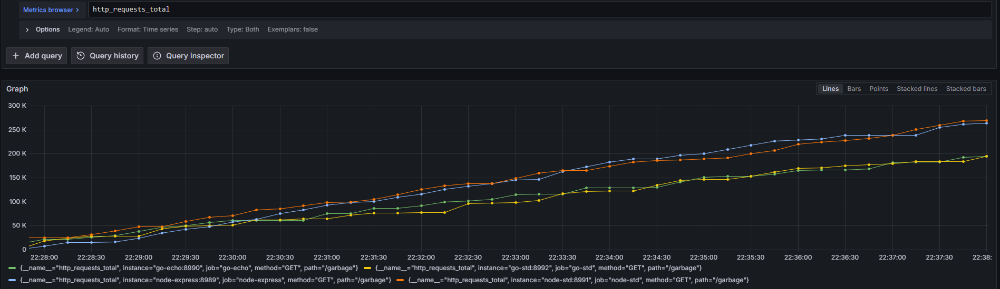
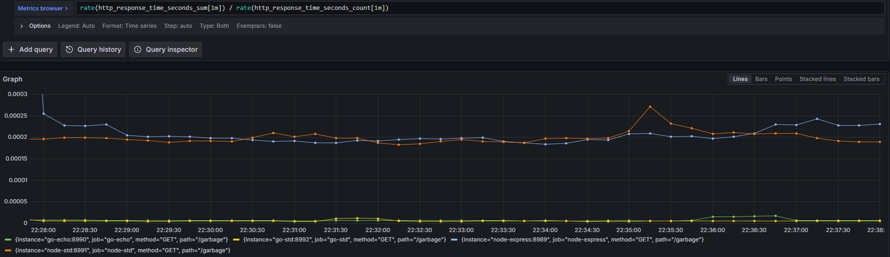
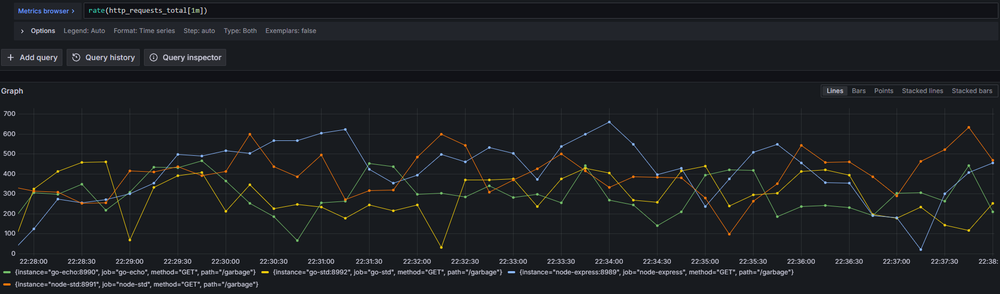
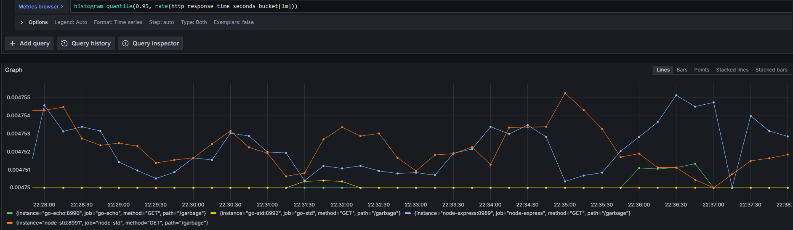
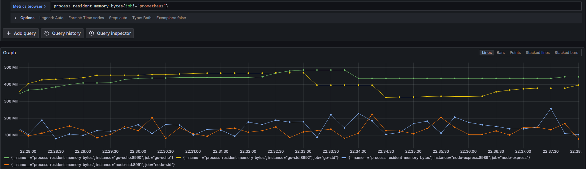
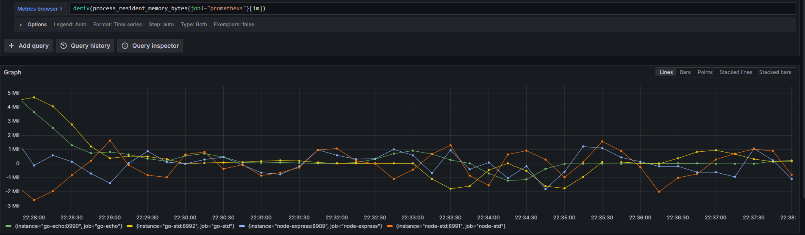
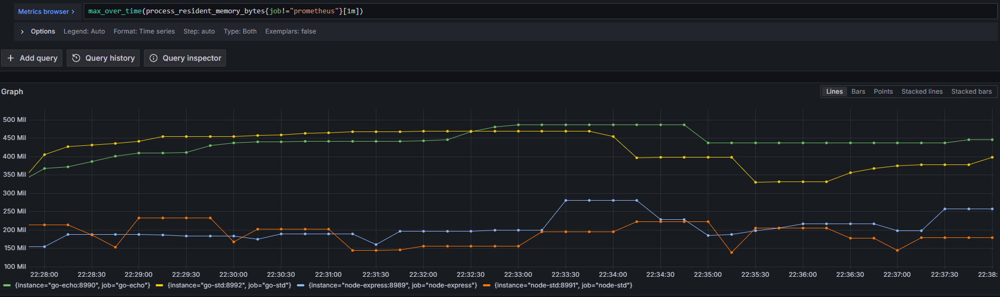
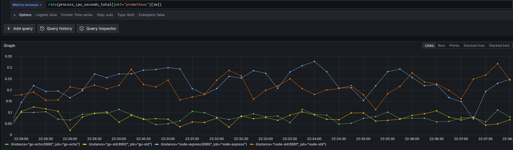

## Garbage - on purpose this time

Simply `/garbage` replying with ok! but creating 10,000 objects (node) or 10,000 structs (go)

##### Requests Total

##### Average Response Times 

#### Request Rate

#### 0.95 Perc Response time

#### Current Memory Usage

#### Rate of Change of Memory Usage      

#### Peak Memory Usage  

#### Rate CPU Usage
