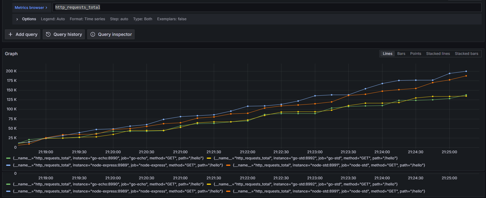
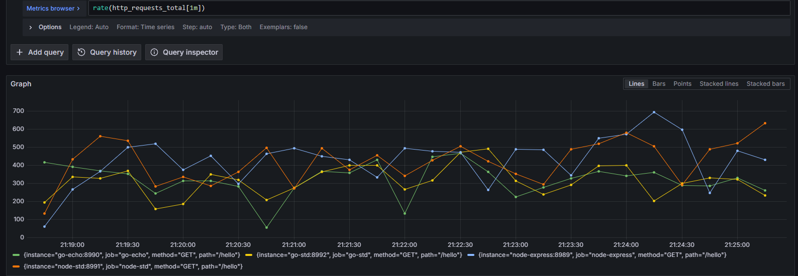

## Hello world!

Simply `/hello` replying with a 'Hello world' string

##### Requests Total

##### Average Response Times 

#### Request Rate

#### 0.95 Perc Response time

#### Current Memory Usage

#### Rate of Change of Memory Usage      

#### Peak Memory Usage  

#### Rate CPU Usage
